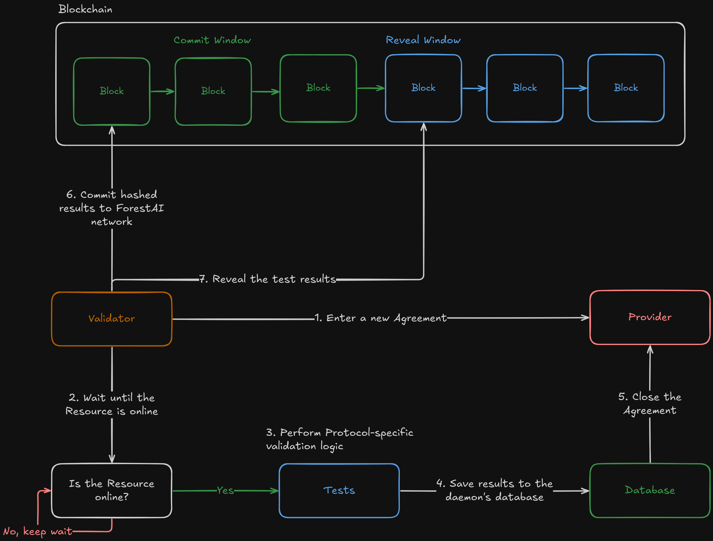

# Validator Template

This repository contains a template that Protocol Owners should customize according to their Protocol requirements on quality validation. Not all Protocols are required to have validation in place, however Protocols with Validators receive higher emissions than those without.

Validators are daemon processes written for specific Protocols that control the quality of Services in a periodic and ongoing fashion. They execute a set of predefined tests on Offers in the Protocol and rank Providers that published those Offers on their quality in comparison to other Providers. This process is crucial for Providers as the emissions they receive are proportional to their ranks.

Adding strong validation support to your Protocol not only increases your emissions but also acts as a competitive advantage over Protocols without it by enhancing the consistency and trustworthiness of your Protocol's Services to end customers.

# Quickstart

> This tutorial is for Protocol Owners

After completing the [Provider Template](https://github.com/Forest-Protocols/provider-template) setup, follow the guide below to implement your Validator daemon.

Index:
- [Fork and edit the repository](#fork-and-edit-the-repository)

## Fork and edit the repository

The diagram of a working Validator daemon is shown below:


The daemon has a single validation definition that can run multiple tests simultaneously. While there is only one validation definition, it can contain multiple tests within it.

Since each Protocol offers unique services, the Validation process and Tests must be customized accordingly. To begin:

1. Fork this repository and clone it locally
2. Open `src/protocol/validation.ts`
3. Locate the `Validation` class, which includes general actions shared between "Tests". Each Test on the other hand should be specialized in validating a different metric / aspect of the Service.

The most critical component is the `calculateScore` method, which computes the total score for a single Validation session based on Test results. These scores determine Provider emissions, so implement this function carefully. The score should be a positive integer - higher scores indicate better service quality, while lower scores indicate poorer performance.

As an example, we'll implement a Validation session with a write speed test for a PostgreSQL Protocol (we assume that we already registered one). Use this as a reference when implementing your own Protocol-specific logic.

Check the code below;

```typescript
import { TestResult } from "@/core/types";
import { BaseValidation } from "@/base/BaseValidation";
import { AbstractTestConstructor } from "@/base/AbstractTest";
import pg from "pg";

// Import tests
import { WriteSpeedTest, WriteSpeedTestResult } from "./tests/WriteSpeedTest";

/**
 * This is the type of details that Validator will fetch from the Provider.
 * In our case we know that Providers will provide connection string for the
 * resources.
 */
export type ResourceDetails = {
  connectionString: string;
};

/**
 * Define the general necessary actions for your tests.
 *
 * NOTE: Each validation run in its own thread.
 */
export class Validation extends BaseValidation<ResourceDetails> {
  // We need to add all of Test implementations into this array.
  // These tests will be executed within the Validation session.
  override readonly tests: AbstractTestConstructor[] = [WriteSpeedTest];

  // Tests will need to connect to the database. Since this is
  // a shared action, we define it in Validation level so all
  // Test implementations will have access to it.
  // For this example we are going to use `pg` package to connect PostgreSQL
  // databases. More info: https://www.npmjs.com/package/pg
  connection!: pg.Client;

  /**
   * Executed before starting to the validation.
   */
  override async onStart() {
    // Initialize the connection
    this.connection = new pg.Client({
      // Validation class has a `resource` field which points to the purchased Resource
      // You can get various information about the resource by that field.
      connectionString: this.resource.details.connectionString,
    });

    // Connect to the database before executing Tests
    await this.connection.connect();
    this.logger.info("Connected to the database");
  }

  /**
   * Executed after all of the Tests are run.
   */
  override async onFinish() {
    // Disconnect from the database.
    await this.connection.end();
    this.logger.info("Disconnected from the database");
  }

  /**
   * Calculates score of the Provider for this validation.
   */
  override async calculateScore(testResults: TestResult[]): Promise<number> {
    let score = 0;

    for (const testResult of testResults) {
      // If the result belongs to WriteSpeedTest
      if (testResult.testName === WriteSpeedTest.name) {
        const result: WriteSpeedTestResult =
          testResult.result as WriteSpeedTestResult;

        // Lower elapsed time will have higher score.
        score += Math.floor(100 / result.elapsedTimeMs);
      }
    }

    return score;
  }
}
```

Then create a file called `src/protocol/tests/WriteSpeedTest.ts`. This will include our actual test logic implementation:

```typescript
import { TestResult } from "@/core/types";
import { AbstractTest } from "@/base/AbstractTest";
import { Validation } from "../validation";

/**
 * This is the type that will be returned by this Test as a structured output.
 * Each Test has a raw output and a structured output.
 *
 * Raw output is a simple string and most of the time it is not machine readable.
 * On the other hand structured output can be used in score calculation phase.
 *
 * This type represents the structured output type of this Test.
 */
export type WriteSpeedTestResult = {
  elapsedTimeMs: number;
};

/**
 * A Test implementation. Each Test must inherit from `AbstractTest`. Unless
 * it is not a human evaluation test. First generic parameter of
 * AbstractTest points to the structured result type of this test
 * and second one points to the Validation class which you don't need to change.
 */
export class WriteSpeedTest extends AbstractTest<
  WriteSpeedTestResult, // Test result type
  Validation // Validation type
> {
  /**
   * Actual logic that performs test.
   * @param validation Validation session
   * @returns Results of the test
   */
  async execute(
    validation: Validation
  ): Promise<TestResult<WriteSpeedTestResult>> {
    try {
      // Create a table
      await validation.connection.query(`
        CREATE TABLE test_data (
          id INT AUTO_INCREMENT PRIMARY KEY,
          data TEXT
          );`);

      // Insert some data and measure elapsed time
      const startTime = Date.now();
      await validation.connection.query(`
          INSERT INTO test_data (data)
          VALUES ('Test data row 1 askdjanskdjnaskdnaksdjnaskjdn1231c23c123c1c31c31c31c31i321ci3n1ic2n31i2n31io23n1i23n1i23n1in31i23n1in31i3n1ic3');
        `);

      // Return the test results
      return {
        isSuccess: true,
        raw: (startTime - Date.now()).toString(),
        result: {
          elapsedTimeMs: startTime - Date.now(),
        },
        testName: this.name,
      };
    } finally {
      // Delete the test table after the test is complete or in case of error
      await validation.connection.query(`DROP TABLE test_data;`);
    }
  }
}
```

The `WriteSpeedTest` visible above is of an "Automated Performance Test" type. This type of tests is suitable for a) direct performance measurements (e.g., response time in milliseconds) or b) when a dataset of known ground truths (inputs and corresponding outputs) is available (e.g., classification tasks). But if your Protocol service cannot be tested with that approach, for instance in cases where the outputs/results must be evaluated by humans (e.g image generation, translation, video generation), you can use `HumanEvaluationTest` instead of `AbstractTest` class to derive your test class.

In `HumanEvaluationTest`, once the test is started, the daemon fetches the outputs from the tested Service and saves them under `data/evaluations` directory as JSON files. Human evaluators need to submit their manual evaluation scores for the generated outputs and the files need to be updated before the defined time runs out so that the daemon can read the file and use human evaluations as scores reported to the blockchain.

A human evaluation test for a translation service would look like this:

```typescript
import { randomInteger } from "@/utils/random-integer";
import { Validation } from "../validation";
import { HumanEvaluationTest } from "@/base/HumanEvaluationTest";
import { sleep } from "@/utils/sleep";
import { parseTime } from "@/utils/parse-time";

/**
 * Generated output by the service. Human evaluators will
 * see this structure within the evaluation JSON files.
 */
export type ExampleHumanEvaluationOutput = {
  sourceLanguage: string;
  targetLanguage: string;
  sourceText: string;
  translatedText: string;
};

/**
 * Test implementation which uses human evaluation approach.
 */
export class ExampleHumanEvaluation extends HumanEvaluationTest<
  ExampleHumanEvaluationOutput,
  Validation
> {
  /**
   * Wait evaluation scores before load them from the output files.
   * In this case it is 1 minute (m = minute, h = hour, s = second)
   */
  protected override readonly waitEvaluationsFor = parseTime("1m");

  /**
   * Fetch the outputs from the service for a specific prompt.
   */
  async getOutputs(
    validation: Validation
  ): Promise<ExampleHumanEvaluationOutput[]> {
    /**
     * Implement the actual logic that retrieves
     * the outputs from the resource for specific prompts.
     *
     * Example dummy logic for translation evaluation:
     */

    const sourceEN = [
      "We live in a big house.",
      "He is my friend.",
      "I have a cat.",
    ];
    const targetSP = [
      "Tengo un gato.",
      "Ella es mi amiga",
      "We live in a big house.",
    ];

    // Simulate a process that take some time (like generating output)
    await sleep(3000);

    /**
     * Return the array of outputs so human
     * evaluators will be able to evaluate those results.
     */
    return Array<ExampleHumanEvaluationOutput>(5).fill({
      sourceLanguage: "english",
      targetLanguage: "spanish",
      sourceText: sourceEN[randomInteger(0, sourceEN.length)],
      translatedText: targetSP[randomInteger(0, targetSP.length)],
    });
  }
}
```

Once you are done with your implementation of test(s), you are good to go! You can commit, push and publish your changes. Actors interested in participating in your Protocol as Validators will now be able to download the daemon code and run it.

You can also replace this README file with `docs/become-a-validator.md` that includes instructions for potential Validators. They will then see that file when they visit your Validator Daemon's GitHub repository.
